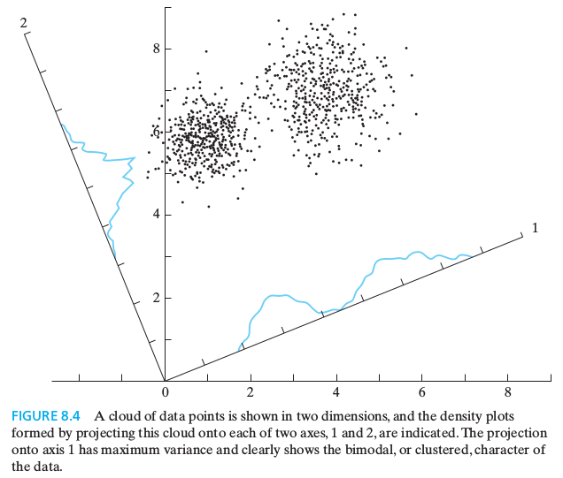
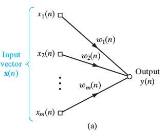

PCA - Principal Component Analysis
===

---

Table of Contents
===
## 1. What is PCA?
## 2. Code Implementation
## 3. Neural Network for PCA

---

What is PCA? - Intro
===
Given $n$ dimensional data sample $\{x_i:\ i=1,\ 2,\ ...,\ m\}$ from sample space $X$ with zero mean, find $k,\ k\leq n$ orthonormal vectors $q_j,\ j=1,\ 2,\ ...,\ k$ which can represents $x_i$ as linear combination of $q_j$ _'sufficiently' close_
In short, we want to do a _dimensionality reduction_

---

PCA? - _'Sufficient'?_
===
We can always represent vector $x_i$ as linear combination of orthonormal basis, i.e. $\{e_j:\ j=1,\ 2,\ ...,\ m\}$
Now Consider the "error"
$$\mathbf{E}[\ ||x_i\ -\ \big \langle x_i,\ e_j\big \rangle\ e_j||^2]$$
It is clear that this error term of $e_j$ for data $X$ is minimized when the variance of projected data on $e_j$
$$\mathbf{E}[\big \langle x_i,\ e_j\big \rangle^2]$$
is maximized

---

PCA? - Toy Example
===

---

PCA? - Eigenvalue Problem
===
TODO: maximize the varience of projected data on $q_j$ restricted by its norm, $||q_j||=1$
Thus, we have to solve
$$J(q_j)=\mathbf{E}[\big \langle x_i,\ q_j\big \rangle^2]- \lambda\ \big \langle q_j,\ q_j\big \rangle $$
$$\nabla_{q_j}J(q_j)=0$$
Solving this equation we get
$$Rq_j=\lambda q_j$$
where $R$ is a covariance matrix for $X$
(explicit derivation would be given at ML SiG)

---

PCA? - Remarks
===
Typically, solving eigenvalue problem is done by SVD or eigendecomposition(spectral decomposition)
However, I don't want to treat them in this SiG (actually I can't)

There is a probabilistic model nearly equivalent to PCA, which can enable us to select a good value for $k$ (google Minka's MLE)

It is fruitful to know _factor analysis_ also 

---

Code Implementation
===

---

Neural Network for PCA - Intro
===
There are four principles for self-organization, namely
1. Self-amplification (Hebbian Learning)
2. Competition
3. Cooperation
4. Structural Information

---

NN, PCA - Maximum Eigenfilter
===

Now consider a neural network consist of a single output neuron,
$$y(n)=\sum_{i=1}^{m}w_i(n)x_i(n)$$
with a Hebb's rule
$$\Delta w_i(n)=\eta y(n)x_i(n)$$

---

NN, PCA - Maximum Eigenfilter (conti.)
===
However, using Hebb's rule without competition, weigths eventually diverge
Thus, we restrain weight vector $||\mathbf{W}(n)||=1$ and updating rule becomes
$$w_i(n+1)=\frac{w_i(n)+\eta y(n)x_i(n)}{(\sum_{j=1}^{m}(w_j(n)+\eta y(n)x_i(n))^2)^{\scriptsize 1/2}}$$
Assuming $\eta\ll 1$, we get
$$w_i(n+1)=w_i(n)+\eta y(x_i(n)-y(n)w_i(n))$$

---

NN, PCA - Maximum Eigenfilter (conti.)
===
It is pretty hard to show that
$$\mathbf{W}(n)\rightarrow q_1,\ \mathbf{E}[y^2]\rightarrow\lambda_{max}\ as\ n\rightarrow\infty$$